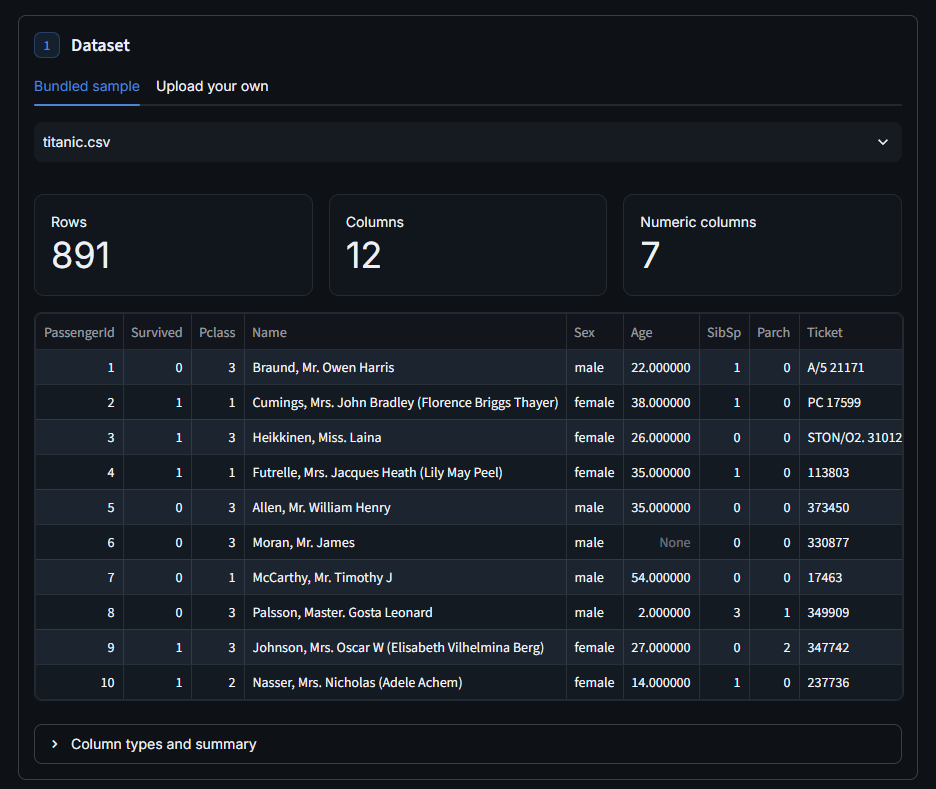
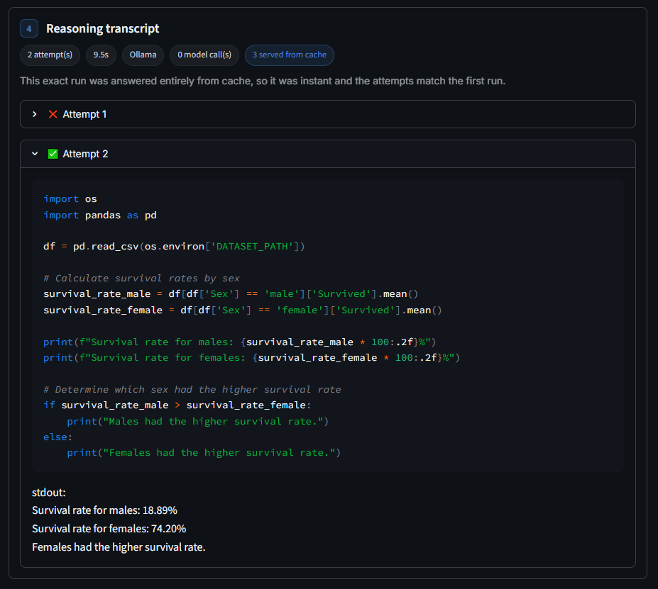
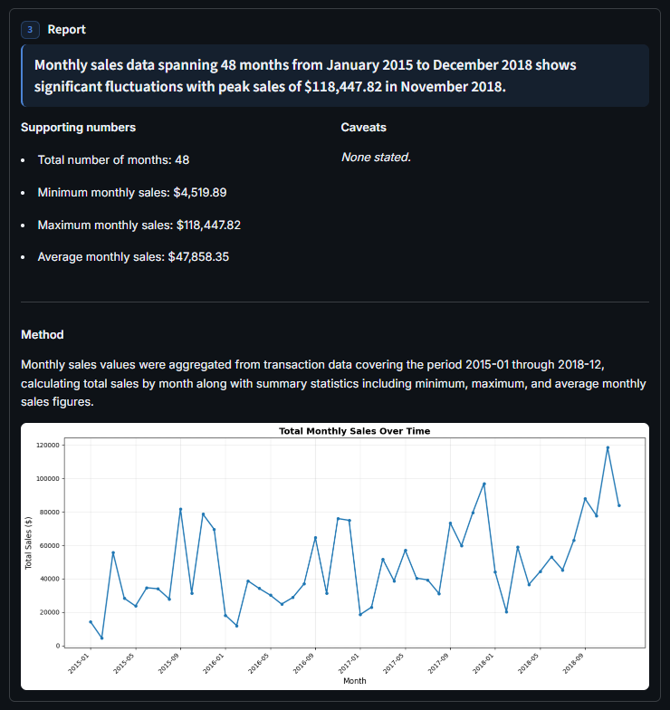
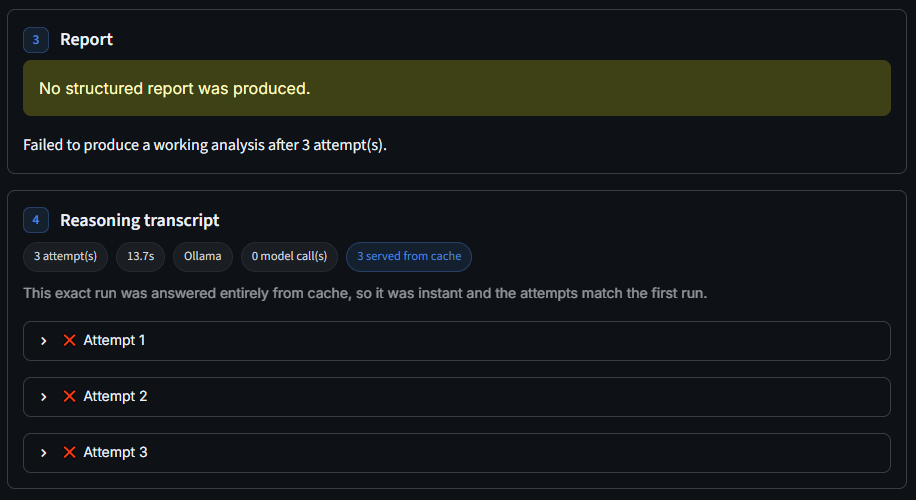
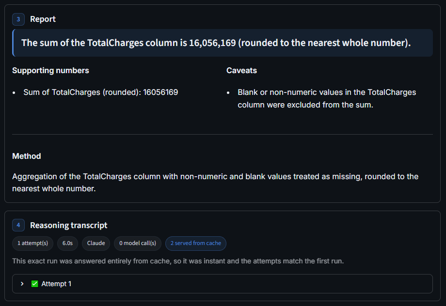

# DataDetective

An autonomous data analyst agent. Give it a business question and a CSV, and it
plans an analysis, writes Python, runs that code in a locked-down Docker sandbox,
fixes its own errors, and returns a structured, validated report.

It runs on a local model (Ollama) for free and private use, or on the Claude API
for stronger results, with the same code path either way.

## Why this exists

The project demonstrates four things that a plain chat assistant does not give you:

1. **Structured deliverables.** Every answer is a validated report with a
   headline finding, the supporting numbers, the method, and caveats.
2. **A privacy option.** The same agent runs on a local model or on the cloud,
   chosen with one setting.
3. **Visible reasoning.** The UI shows every attempt the agent made, including
   the code that failed and the fix on the next try.
4. **Measured quality.** An evaluation harness scores the agent on real datasets
   with known answers.

## Screenshots

Pick a dataset and preview it before asking:



The reasoning transcript shows the agent correcting itself. For the question
*"Which sex had the higher survival rate, male or female?"* on the Titanic data,
the first attempt failed and the second succeeded.



When a question asks for a visualization, the agent writes and runs the plotting
code and the chart appears in the report. Here for
*"Plot total monthly sales over time"* on the Superstore data:



## How it works

```
question + dataset
      |
   write code   <-----------------------+
      |                                  |
  run in Docker sandbox                  | (failed, attempts left:
      |                                  |  feed the error back)
  success? --- no ---------------------->+
      |
     yes
      |
  write a structured report  (retry on validation errors)
      |
  AnalysisReport
```

The agent is a small state machine built with LangGraph. A node asks the model
for code, a node runs it in the sandbox, and a conditional edge loops back on
failure until the code works or the attempt budget runs out. On success, a
further step turns the raw output into a Pydantic-validated report.

## Key components

- **Hardened Docker sandbox** ([src/datadetective/sandbox/](src/datadetective/sandbox/)).
  Untrusted code runs with no network, a read-only root filesystem, a memory cap,
  a CPU cap, a process limit, all Linux capabilities dropped, no privilege
  escalation, a non-root user, and a hard timeout that kills the container.
- **Self-correcting agent** ([src/datadetective/agent/](src/datadetective/agent/)).
  LangGraph graph with a write-code, execute, and report loop, and a per-attempt
  history for the transcript.
- **Swappable backends** ([src/datadetective/llm/](src/datadetective/llm/)).
  One `LLMBackend` contract with an Ollama implementation and a Claude
  implementation, plus a caching wrapper that stores each answer on disk so
  identical requests are never paid for twice.
- **Validated report** ([src/datadetective/report/](src/datadetective/report/)).
  A Pydantic model plus a build step that retries when the model returns invalid
  JSON or a report that fails validation.
- **Streamlit UI** ([app.py](app.py)). Pick a dataset, preview it, choose the
  backend, ask a question, and read the report, any charts the agent drew, and
  the reasoning transcript. The agent saves a matplotlib figure when a question
  asks for a trend, distribution, or other visual.
- **Evaluation harness** ([src/datadetective/eval/](src/datadetective/eval/)).
  Deterministic scoring over synthetic and real datasets, reported per tier.

## Project structure

```
app.py                     Streamlit UI
docker/Dockerfile.sandbox  the sandbox image
src/datadetective/
  sandbox/                 Docker execution (config, executor)
  llm/                     base contract, Ollama, Claude, cache
  agent/                   LangGraph state, nodes, graph, single-step
  report/                  Pydantic model and report builder
  eval/                    benchmark cases, scorer, runner
data/sample_datasets/      datasets used by the UI and the eval
tests/                     pytest suite
```

## Setup

### Prerequisites

- Python 3.12
- Docker (running), for the sandbox
- Ollama with the `qwen2.5:7b` model, for the local backend (optional if you use Claude)
- An Anthropic API key, for the cloud backend (optional)

### Install

```bash
python -m venv .venv
.venv/Scripts/python.exe -m pip install -e ".[dev]"
```

This installs the package in editable mode, so `datadetective` is importable
and the `datadetective-eval` command is available. A plain `requirements.txt` is
also provided if you prefer it.

### Build the sandbox image

```bash
docker build -t datadetective-sandbox:latest -f docker/Dockerfile.sandbox .
```

### Local model (optional)

```bash
ollama pull qwen2.5:7b
ollama serve
```

### Cloud model (optional)

Copy `.env.example` to `.env` and set your key:

```
ANTHROPIC_API_KEY=your-api-key-here
```

## Usage

### Run the app

```bash
.venv/Scripts/python.exe -m streamlit run app.py
```

Opens at http://localhost:8501.

### Run the evaluation

```bash
datadetective-eval                                          # local Ollama (free)
datadetective-eval --backend cloud --model claude-sonnet-4-6   # Claude (costs money)
```

(Equivalent to `python -m datadetective.eval.runner`.)

### Run the tests

```bash
.venv/Scripts/python.exe -m pytest              # all tests (Docker-marked tests need Docker)
.venv/Scripts/python.exe -m pytest -m "not docker"   # fast tests only
```

## Evaluation results

The same 32 cases were run on both backends:

| backend                   | accuracy | completion | avg attempts |
|---------------------------|----------|------------|--------------|
| Local `qwen2.5:7b`        | 97%      | 97%        | 1.09         |
| Cloud `claude-sonnet-4-6` | 100%     | 100%       | 1.00         |

The cases are split into tiers, scored separately so the trivial cases do not
inflate the headline: smoke (7 tiny synthetic cases, fast regression coverage),
benchmark (17 real-data cases including multi-step questions), and hard (8
harder multi-step and messy-data questions).

The two models diverge exactly where it is hard. The local model scored 88% on
the hard tier: it failed the one case that requires data cleaning, summing
Telco's `TotalCharges` column which contains blank strings. It confused two
pandas APIs, writing `.astype(float, errors='coerce')` instead of
`pd.to_numeric(..., errors='coerce')`, and could not recover in three attempts.
Sonnet handled every case on the first try, including that one.

The honest reading: on well-posed, clean-data questions a free, local 7B model
matches the frontier model, and the self-correction loop covers the occasional
first-try miss. The frontier model pulls ahead on messier, multi-step work. The
remaining trade-offs are cost, speed, and privacy, which favor the local option.

The same data-cleaning question on each backend, the failure and the fix:

**Local (Ollama): no working analysis after three attempts.**



**Cloud (Claude): correct on the first try.**



## Design decisions

- **Docker isolation is non-negotiable.** The agent runs model-written code, so
  it runs inside a container with every reasonable limit applied.
- **One backend contract.** Adding the Claude backend was a single class, because
  the agent only depends on an abstract `generate` method. The same reason makes
  caching a transparent wrapper.
- **Deterministic eval, not an LLM judge.** Scoring checks that known answer
  tokens appear in the report. It is free, reproducible, and never disagrees with
  itself.
- **Caching protects a small budget.** Each unique request is paid once; every
  identical rerun is served from disk.

## Datasets

- `sample_sales.csv`, `employees.csv`, `monthly_visits.csv`: small synthetic
  datasets created for this project.
- `titanic.csv`: the classic Titanic passenger dataset.
- `superstore.csv`: the Sample Superstore retail dataset.
- `telco_churn.csv`: the IBM Telco customer churn dataset.

The real datasets are included for reproducible evaluation and belong to their
original authors.
